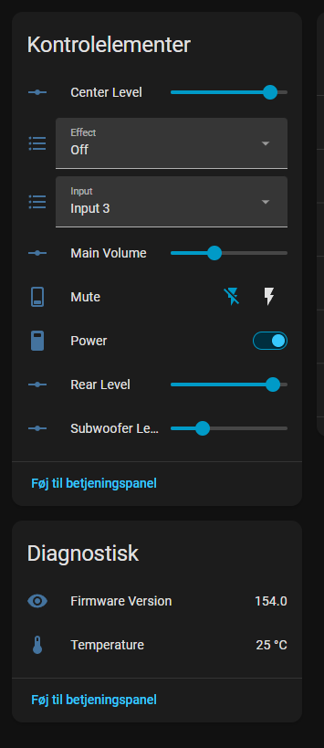
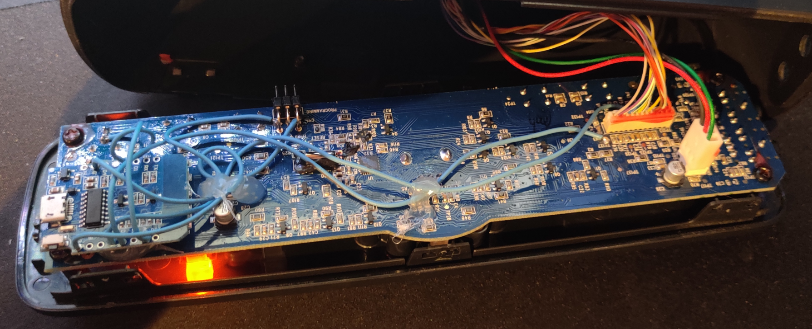

# ESPHome Z906

ESPHome external component for controlling a Logitech Z906 speaker system over UART.

This component exposes the Z906 as a hub-style integration. Adding a single `z906:` block creates the main entities automatically.

## Images






## Features

- Auto-created main entities:
  - `Main Volume`
  - `Rear Level`
  - `Center Level`
  - `Subwoofer Level`
  - `Input`
  - `Effect`
  - `Mute`
  - `Temperature`
  - `Firmware Version`
- Optional integrated power handling using a GPIO-driven front-panel power pulse and LED-voltage sensing.
- Optional advanced entities that stay hidden unless explicitly enabled:
  - `Inputs Blocked`
  - `Save EEPROM`
  - `Reset Power-Up Timer`

## Repository Layout

- `components/z906/` - the external component
- `examples/basic.yaml` - minimal UART-only setup
- `examples/power.yaml` - UART setup plus GPIO/ADC-assisted power integration

## Install From GitHub

Add it to your ESPHome config like this:

```yaml
external_components:
  - source:
      type: git
      url: https://github.com/mads03dk/esphome-z906
      ref: main
    components: [ z906 ]
```

## Quick Start

Minimal configuration:

```yaml
uart:
  id: uart_bus
  tx_pin:
    number: D5
    mode:
      output: true
      open_drain: true
  rx_pin: D6
  baud_rate: 57600
  parity: ODD
  data_bits: 8
  stop_bits: 1

z906:
  id: z906_amp
  uart_id: uart_bus
  update_interval: 1s
```

See `examples/basic.yaml` for a complete ESPHome node configuration.

## Power Integration

The optional `power:` block wraps the extra hardware needed to simulate the Z906 power button and infer the actual power state from the front-panel LED voltage.

```yaml
z906:
  id: z906_amp
  uart_id: uart_bus
  update_interval: 1s
  power:
    pin:
      number: D2
      inverted: true
      mode:
        output: true
        open_drain: true
    threshold: 0.45
```

Notes:

- `pin` is the GPIO used to pulse the Z906 front-panel power button circuit.
- `threshold` is the LED-voltage cutoff used to decide whether the amplifier is on.
- The power helper also creates an internal LED-voltage sensor and an internal powered-state binary sensor by default.
- This wiring is hardware-specific. Keep it separate from the basic UART setup unless you have already built the button/LED interface hardware.
- Do not rely on the 5V or 3.3V regulator in the Z906 console/cable assembly to power an ESP8266 or ESP32. In testing, it was not strong enough to power the MCU reliably. Use an external power supply and share ground with the Z906 interface wiring.

See `examples/power.yaml` for a complete example.

## Optional Advanced Entities

These entities are opt-in and only appear if you configure them explicitly:

```yaml
z906:
  id: z906_amp
  uart_id: uart_bus
  inputs_blocked: {}
  save_eeprom: {}
  reset_power_up_timer: {}
```

## Notes And Limitations

- The component currently targets the Logitech Z906 serial protocol as observed from the original control console.
- On ESP8266, long UART writes can be unreliable on software-serial pin choices. This component therefore uses single-step level commands for volume changes instead of long status-frame writes.
- If you see repeated checksum warnings on ESP8266, the transport path is the first thing to suspect (perhaps the TX and RX is switched?).
- The TX pin is configured as open-drain in the examples because that matches the working hardware setup used during development.
- Power integration requires external MCU power. Do not expect the Z906 console/cable regulators to supply enough current for an ESP8266 or ESP32.

## Acknowledgements

The serial protocol decoding and reverse-engineering work used for this project was heavily informed by:

- https://github.com/zarpli/Logitech-Z906

## Development Note

This repository is mainly AI-assisted coding with human read-through, adjustment, and hardware testing.

## Local Example Usage

The example files in `examples/` use a local external component source:

```yaml
external_components:
  - source:
      type: local
      path: ../components
    components: [ z906 ]
```

That makes the examples runnable directly from a local checkout of this repository. End users should use the GitHub install snippet shown earlier instead.